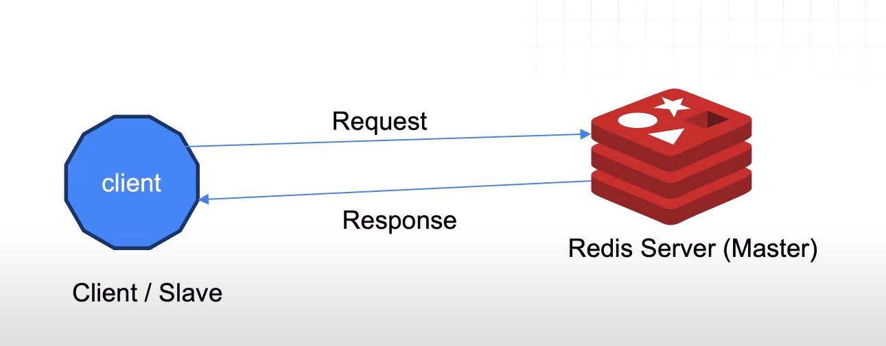

# Redis

https://www.youtube.com/watch?v=aqFFghu541I&t=204s

Redis, an acronym for **Remote Directory Server**, is presented as a high-performance, in-memory data structure store. Its primary applications include serving as a **database, a cache, and a message broker.** The core advantage of Redis lies in its in-memory storage, which facilitates exceptionally fast read and write operations, making it ideal for real-time applications such as location tracking, where persistent databases like MySQL or PostgreSQL would struggle with high-frequency updates.

While its default behavior is in-memory, Redis also offers configurable data persistence to disk. It supports a versatile range of data structures, including Strings, Hashes, Lists, Sets, and more complex types like Geospatial Indexes and Streams. The architecture is a straightforward client-server (or master-slave) model, where clients (which can be a command-line interface or an application like a Spring Boot or Node.js server) send commands to the Redis server for processing. The video provides detailed, step-by-step instructions for installing Redis on macOS, Windows (via WSL2), and using Docker, followed by a hands-on demonstration of the Redis CLI and practical operations on core data types. The course positions Redis as a critical tool for developers building large-scale applications that require high throughput and low latency.

## **1. Introduction to Redis**

### **1.1. Definition and Core Concepts**

Redis, short for **Remote Directory Server**, is fundamentally an in-memory data store. It is designed to be used in multiple capacities:

- **Database:** It can function as a primary database.
- **Cache:** This is its most common use case, especially in large applications with high read/write loads on a persistent database. By caching frequently accessed data, Redis reduces the strain on the primary database.
- **Message Broker:** It can facilitate real-time messaging systems.

The defining characteristic of Redis is that it stores data in the primary memory (RAM) by default. This contrasts with traditional databases like MySQL or PostgreSQL, which store data on disk. The in-memory nature allows for significantly faster data access.

**1.2. Primary Use Cases**

Redis is particularly effective in scenarios demanding high-speed operations.

- **Real-Time Applications:** Its speed makes it "ideal for real-time requirements." An example provided is a location-tracking application for a service like Zomato. As a delivery person moves, their location changes every second, generating a high volume of write operations. Using a traditional disk-based database would be inefficient and could potentially crash under the load of many concurrent users.
- **Caching Strategy:** In this scenario, Redis can be used to store the real-time location data. Once the trip is complete (the delivery person reaches the destination), the final path data (a set of coordinates) can be permanently stored in a database like MySQL for future reference. Redis handles the high-frequency, ephemeral data, while the persistent database stores the final, consolidated information.

## **2. Key Features of Redis**

The source outlines several critical features that differentiate Redis from other database systems.

| Feature | Description |
| --- | --- |
| **In-Memory Storage** | By default, data is stored in primary memory, enabling extremely fast read and write operations. This is the foundation of its performance for caching and real-time use cases. |
| **Data Persistence** | Despite being an in-memory store, Redis provides options for persistence. Data can be configured to be dumped to disk, ensuring that it is not lost if the server restarts. |
| **Data Structures** | Redis is not limited to simple key-value strings. It supports a rich set of data structures, including Strings, Hashes, Lists, Sets, Sorted Sets, Bitmaps, HyperLogLogs, and Geospatial Indexes. |
| **Replication** | It supports a master-slave replication architecture. Data can be replicated across multiple servers for redundancy and failover, ensuring high availability. If one node crashes, data is safe on the others. |
| **Pub/Sub Messaging** | Redis has built-in Publish/Subscribe capabilities, allowing it to act as a message broker for building real-time messaging applications. |

## **3. Redis Architecture**

Redis operates on a classic **client-server architecture**, which is also referred to as a **master-slave architecture**.

- **Redis Server (Master):** This is the core component that stores data and executes commands. All processing happens on the server.
- **Redis Clients (Slaves):** Clients are used to interact with the server. A client sends a command (request) to the server, the server processes it, and sends back a response.

Clients can take several forms:

- A command-line interface (CLI).
- A graphical user interface (GUI) client.
- An application (e.g., a Spring Boot, Java, or Node.js application) can be configured to act as a client, allowing it to programmatically store and retrieve data from the Redis server.

## **4. Installation and Setup**

https://redis.io/docs/latest/operate/oss_and_stack/install/archive/install-redis/

## **5. Redis Command-Line Interface (CLI)**

### **5.1. The Command**

The `HELP` command is highlighted as a crucial tool for discovering and understanding other commands, eliminating the need to memorize them.

- **General Help:** `HELP` provides basic usage instructions.
- **Specific Command Help:** `HELP @<command_group>` provides detailed information and a list of commands for a specific category. Examples include:
    
    ◦ `HELP @string`
    
    ◦ `HELP @hash`
    
    ◦ `HELP @list`
    
    ◦ `HELP @server`
    
    ◦ `HELP @connection`
    

### **5.2. Example Administrative Commands**

The video demonstrates several commands to inspect the server and client connections:

- `ACL USERS`: Lists all Access Control List users.
- `ACL WHOAMI`: Shows the currently authenticated user (e.g., `default`).
- `TIME`: Returns the server's current time.
- `INFO`: Provides detailed information and statistics about the server.
- `CLIENT LIST`: Lists all currently open client connections.
- `CLIENT INFO`: Returns detailed information about the current client's connection.

## **6. Core Redis Data Types and Operations**

A significant portion of the course is dedicated to hands-on demonstrations of Redis's data types.

### **6.1. Strings**

Strings are the most basic Redis data type, capable of storing text or binary data like images or serialized objects.

- **SET <key> <value>:** Sets a key to a string value. e.g., `SET name "Durgesh Kumar Tiwari"`.
- **GET <key>:** Retrieves the value of a key. e.g., `GET name`.
- **APPEND <key> <value>:** Appends a string to an existing value. If the key doesn't exist, it is created. e.g., `APPEND channel " Please Subscribe"`.
- **INCR <key>:** Increments the integer value of a key by one. e.g., `INCR user_id`.
- **GETDEL <key>:** Retrieves the value of a key and then deletes the key.
- **GETRANGE <key> <start> <end>:** Returns a substring of the value. e.g., `GETRANGE channel 0 6`.

### **6.2. Hashes**

Hashes are collections of key-value pairs, ideal for representing objects like a user or a product.

- **HSET <key> <field1> <value1> [<field2> <value2> ...]:** Sets one or more field-value pairs in a hash. e.g., `HSET student name "Rajan" phone "1234567890"`.
- **HGET <key> <field>:** Retrieves the value of a specific field from a hash. e.g., `HGET student name`.
- **HGETALL <key>:** Retrieves all fields and their values from a hash. e.g., `HGETALL student`.
- **HDEL <key> <field1> [<field2> ...]:** Deletes one or more fields from a hash.
- **HEXISTS <key> <field>:** Checks if a field exists in a hash. Returns `1` if it exists, `0` otherwise.
- **HKEYS <key>:** Returns all field names (keys) in a hash.
- **HLEN <key>:** Returns the number of fields in a hash.
- **HMGET <key> <field1> [<field2> ...]:** Retrieves the values of multiple specified fields.

### **6.3. Lists**

Lists are ordered collections of strings.

- **LPUSH <key> <element1> [<element2> ...]:** Adds elements to the **left** side (head) of a list. e.g., `LPUSH friends "Ram" "Shyam"`.
- **RPUSH <key> <element1> [<element2> ...]:** Adds elements to the **right** side (tail) of a list. e.g., `RPUSH marks 34 12 11`.
- **LRANGE <key> <start> <stop>:** Retrieves a range of elements from a list. e.g., `LRANGE marks 0 -1` (gets all elements).
- **LPOP <key>:** Removes and returns the first element (from the left).
- **RPOP <key>:** Removes and returns the last element (from the right).
- **LLEN <key>:** Returns the length of the list.
- **LSET <key> <index> <element>:** Sets the value of an element at a specific index.
- **LINSERT <key> BEFORE|AFTER <pivot_element> <new_element>:** Inserts an element before or after another element in the list.

### **6.4. Sets**

Sets are unordered collections of unique strings.

- **SADD <key> <member1> [<member2> ...]:** Adds one or more members to a set. Duplicates are ignored.
- **SCARD <key>:** Returns the number of members in a set (cardinality).
- **Set Operations:** Redis supports standard set operations like `SDIFF` (difference), `SINTER` (intersection), and `SUNION` (union).
- **SPOP <key>:** Removes and returns one or more random members from a set.

### **6.5. Other Data Types**

The video briefly mentions several other advanced data types:

- **Sorted Sets:** Similar to sets, but each member is associated with a score, which is used to keep the members ordered. Useful for leaderboards.
- **Bitmaps:** Allows for manipulation of individual bits within a string value.
- **HyperLogLogs:** A probabilistic data structure used for counting unique elements with very low memory usage.
- **Geospatial Indexes:** Used to store and query geographical data like latitude and longitude.
- **Streams:** A log-like data structure for managing real-time data, logs, and messaging streams.

## 7. **Spring Boot CRUD with Redis**